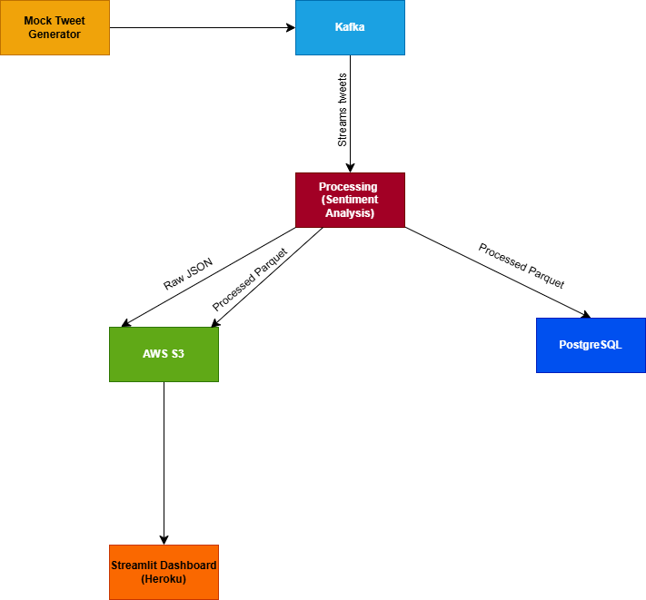

# Real-Time Crypto Tweet Sentiment Analysis Pipeline with Live Dashboard

## Overview
I designed and deployed an end-to-end data engineering pipeline to simulate, process, and analyze cryptocurrency-related tweets in real-time. The system ingests mock tweets, streams them via Kafka, performs sentiment analysis, stores data in S3 (Parquet) and PostgreSQL, and visualizes insights through a live Streamlit dashboard hosted on Heroku. This project demonstrates scalable data processing and real-time analytics, targeting crypto market trends—perfect for portfolio showcasing or crypto sentiment monitoring.

## Technologies
- **Languages**: Python
- **Streaming**: Apache Kafka
- **Storage**: AWS S3 (Parquet), PostgreSQL
- **Processing**: VADER Sentiment Analysis
- **Visualization**: Streamlit, Matplotlib, WordCloud
- **Deployment**: Heroku, Git
- **Libraries**: pandas, pyarrow, boto3, psycopg2, faker

## Architecture
**Ingestion**: Mock tweets generated at ~2K/minute -> Kafka topic 'tweets'.
**Porcessing**: Kafka Consumer -> Sentiment analysis -> S3 ( raw JSON, processed Parquet) + PostgreSQL.
**Dashboard**: Heroku-hosted Streamlit app pulling latest Parquet from S3, updating every 10 seconds with visuals ( pie chart, time series, etc.).

## Key Features
- Real-Time Streaming: Processes 10K tweets in 5 minutes (~2K/minute) using Kafka.
- Scalable Storage: Raw JSON and processed Parquet in S3, structured data in PostgreSQL.
- Rich Analytics: Live dashboard with pie charts, time series, word clouds, heatmaps, and top crypto mentions.
- Deployment: Fully deployed on Heroku for public access.
- Modular Design: Easily adapts to real Twitter API with credentials.

## Results
- Achieved ~2K tweets/minute throughput.
- Deployed dashboard at [Heroku](https://twitter-sentiment-dashboard-2d515f0d9bc8.herokuapp.com/), updating live every 10 seconds.
- Stored ~1M tweets (mock data) across S3 andPostgreSQL over extended runs, ready for querying.

## Demo
- Live Dashboard: [Heroku](https://twitter-sentiment-dashboard-2d515f0d9bc8.herokuapp.com/)
- Code: [GitHub](https://github.com/deepaanna/twitter-sentiment-pipeline)

## Lessons Learned
- Mastered Kafka for real-time streaming and optimized consumer performance.
- Learned to balance S3 and database storage for cost and query efficiency.
- Overcame Twitter API v2 limitations by pivoting to mock data, enhancing adaptability.
- Gained hands-on experience deploying Python apps to Heroku with secure credential management.