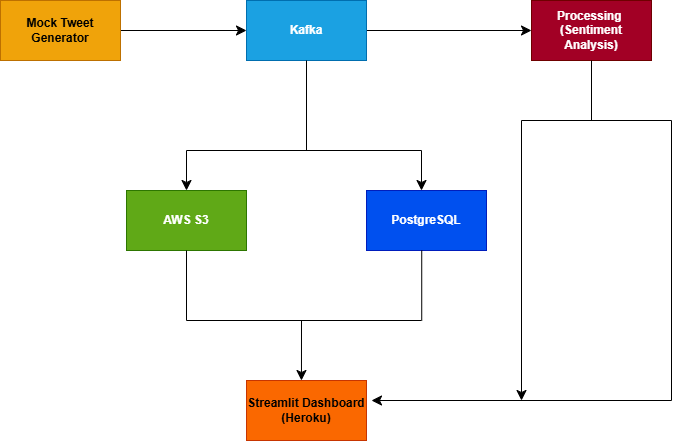

 
# Real-Time Twitter Sentiment Analysis Pipeline
A scalable pipeline to ingest tweets, analyze sentiment, and deliver insights in real-time.

## Setup
1. Install dependencies: `pip install -r requirements.txt`
2. Set up Kafka locally (see kafka docs).
3. Add your Twitter Bearer Token to `config/.env`.
4. Run ingestion: `python src/ingest/ingest_tweets.py`
5. Run processing: `python src/process/process_tweets.py`

## Architecture
